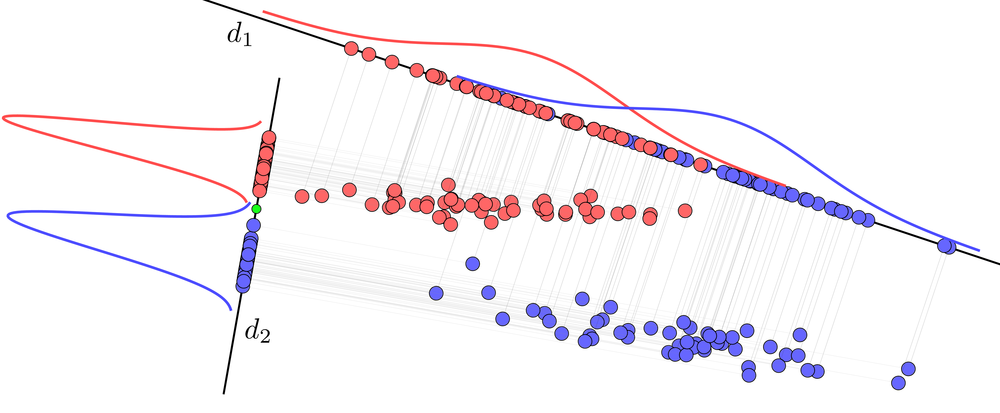

# Linear Discriminant Analysis (LDA)
- Author: [Giang Nguyen](https://github.com/GiangCo12)
- Created at: Jan 21st, 2024
- [Source code](../../decomposition/LDA.py)

## Introduction
While PCA is the most popular algorithm used for dimension reduction, it has a disadvantage: **it is for unsupervised learning**. Take a look at this picture:

*Source: https://machinelearningcoban.com/2017/06/30/lda/*

With PCA, it doesn't see the colors (reds and blues) of samples, which means all samples are treated equally. PCA will see that the best component is $d_1$. 

But the new projected samples on $d_1$ are poor for classification since they overlap significantly.

LDA was born to solve this problem. It is a **supervised learning** method, meaning the labels ($y$) affect the result.

---

## Step-by-step

Given that you have a dataset $(X, y)$.  
$X.shape=(N,F)$ and $y.shape = (N,)$.

### Step 1: Calculate the overall mean for each feature in $X$

$$
\mu = \frac{1}{N}\sum_{j=0}^{F}\sum_{i=0}^{N}{X_{i:j}}
$$

---

### Step 2: For each class, calculate the "within-class" scatter matrix and "between-class" scatter matrix

Suppose that $X_c$ is a subset of samples of class $c$, size of subset is $N_c$.

$$
\mu_c = \frac{1}{N_c}\sum_{j=0}^{F}\sum_{i=0}^{N_c}{X_{i:j}}
$$

- Within-class scatter matrix:

$$
S_W = \sum_i^{C}(X_i - \mu_i)^2
$$

- Between-class scatter matrix:

$$
S_B = \sum_i^{C} N_i * (\mu_i - \mu)^2
$$

---

### Step 3: Calculate the target matrix

$$
T = S_W^{-1} S_B
$$

Our goal is to **maximize** $T$ → maximize $S_B$, minimize $S_W$.

---

### Step 4: Compute eigenvalues and eigenvectors of $T$

$$
V,E = \text{eigen}(T)
$$

Where:
- $V$: eigenvalues
- $E$: eigenvectors

---

### Step 5: Sort the eigenvectors by eigenvalues and project $X$ by the top $k$ eigenvectors

If you want to know more about the mathematics behind this, check the references below.

---

## References

- [Machine Learning Cơ bản](https://machinelearningcoban.com/2017/06/30/lda/)
- [Wikipedia - LDA](https://en.wikipedia.org/wiki/Linear_discriminant_analysis)
- [LDA on Towards Data Science](https://towardsdatascience.com/linear-discriminant-analysis-explained-f88be6c1e00b)
